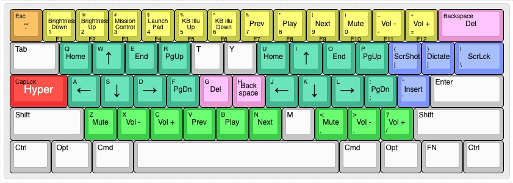

# Karabiner-Elements complex modification rules

[Karabiner-Elements](https://karabiner-elements.pqrs.org/) is a Mac app that lets you define custom keyboard mappings and layouts. This repository is my personal Karabiner-Elements (KE for short) complex modification rules.

To use, place the json files in `complex_modifications` folder into your KB rules folder below, and then add them in the KE Preferences -> Complex Modifications.
> `~/.config/karabiner/assets/complex_modifications/`

# Documentations

[Karabiner-Elements documentation](https://karabiner-elements.pqrs.org/docs/)

# Notes

If you swap Option key and Command key mapping in your MacOS keyboard setting for KE keyboard ("Karabiner DriverKit VirtualHIDKeyboard"); for KE to trigger Command key you will have to send Option key code, and for KE to trigger Option key you will have to send Command key code. To use the json files in this repo, you should NOT swap CMD and OPT key in the MacOS keyboard setting.

# FAQs

Q: My changes in json file doesn't work?
> A: KE currently does not pick up changes in rule json files on-the-fly. You will need to manually remove the rules from within KE and then add them again.

Q: How do I find out my keyboard device vendorID and productID?
> A: Open Karabiner Event Viewer and go to the Device tab, you can find the info there.

Q: Karabiner-Elements does not work on my Bluetooth keyboard?
> A: By default Karabiner Elements is not enabled to control mouse. When a Bluetooth keyboard is connected to a Mac, the connection is usually considered as a combo of keyboard + mouse connection, hence it is not enabled to be controlled by KE by default. You can go to the Preferences -> Deveices and then tick the "modify event" checkbox for the Bluetooth keyboard/connection to enable it.

# My rules

## tomy_base.json
Defines the base rules that are useful for any keyboard layouts.

- `CMD` <-> `OPT`
  - Swap Command and Option keys
- `PrtScr` -> Screen capture
  - PrintScreen key does not work in Mac, so we re-define it to bring up Mac built in screen capture tool
- `ScrLck` -> Dictation
  - ScrollLock key does not work in Mac, so we re-define it to start dictation
  - Note: you need to set pressing Fn/Globe key twice to start dictation (you can set it in Settings -> Keyboard -> Keyboard)
- `Pause` -> Lock screen
  - Pause/PageBreak key does not work in Mac, so we re-define it to lock your screen

## tomy_hyper.json
Defines the rules for Hyper key which can give you a 2nd layer of keyboard layout for various functionality.

- `CapsLock` -> `Hyper` = `Ctrl` + `Cmd` + `Opt` + `Shift`
	- Defines CapsLock key as Hyper key (which is Control + Command + Option + Shift)
	- If you hold down CapsLock then you are triggering the Hyper key
	- If you press CapsLock once only (tap it), then it works normally as CapsLock
- `Hyper` + `1` -> `F1`, `Hyper` + `2` -> `F2`, ... `Hyper` + `0` -> `F10`, `Hyper` + `-` -> `F11`, and `Hyper` + `=` -> `F12`
  - Defines F1 - F12 with the number row keys
- `Hyper` + `Esc` -> grave accent `` ` ``
  - A very common 60% keyboard mapping to use Esc key as grave accent/tilda key
- `Hyper` + `W` `A` `S` `D` -> arrow keys
  - W = Up, A = Left, S = Down, D = Right
- `Hyper` + `I` `J` `K` `L` -> arrow keys
  - I = Up, J = Left, K = Down, L = Right
- `Hyper` + `Q` -> `Home` and `Hyper` + `E` -> `End`
- `Hyper` + `U` -> `Home` and `Hyper` + `O` -> `End`
  - The 2 rules above define the two keys around WASD & IJKL as Home key and End key 
- `Hyper` + `R` -> `PgUp` and `Hyper` + `F` -> `PgDn`
- `Hyper` + `P` -> `PgUp` and `Hyper` + `;` -> `PgDn`
  - The 2 rules above define the two keys on the right side of WASD & IJKL as PageUp key and PageDown key
- `Hyper` + `G` -> `Delete` and `Hyper` + `H` -> `Backspace`
  - This defines the keys next to your "home key markers" (F key and J key) as Delete key and Backspace key, with the one on the left (G key) being Delete key and the one on the right (H key) being Backspace key
- `Hyper` + `Backspace` -> `Delete`
  - A very common 60% keyboard mapping to use Backspace key as Delete key
- `Hyper` + `Z` -> Mute, `Hyper` + `X` -> Volume-, and `Hyper` + `C` -> Volume+
- `Hyper` + `,` -> Mute, `Hyper` + `.` -> Volume-, and `Hyper` + `/` -> Volume+
  - The 2 rules above define the 3 keys to the side of left shift and right shift to be volume controls
- `Hyper` + `V` -> PreviousTrack, `Hyper` + `B` -> Play/Pause, and `Hyper` + `N` -> NextTrack
  - This rules defines the 3 keys below the two "home key markers" (F key and J key) to be media playback controls
- `Hyper` + `[` -> Screen Capture, `Hyper` + `]` -> Start Dictation, and `Hyper` + `\` -> Lock Screen
  - This defines the 3 keys to the right of P key to be PrintScreen, ScrollLock, and Pause keys. In my base rules they work as Screen Capturing key, Start Dictation key, and Lock Screen key respectively
  - Note: you need to set pressing Fn/Globe key twice to start dictation (you can set it in Settings -> Keyboard -> Keyboard)
- `Hyper` + `'` -> `Insert`
  - It just makes sense to me to have quote works as Insert key as it is under the ScreenShot `[` , ScrollLock `]`, and PageBreak `\` keys mapping I defined above

## tomy_60_percent.json
Defines rules that useful for 60% and 65% keyboards.

- `Insert` -> `` ` ``
  - Insert key is mapped to grave accent (`) & tilde (~) key
  - Some 65% keyboards have insert key but no grave accent (`) & tilde (~) key. I need this rule as I use grave accent key much more often than insert key.
- `Ctrl` + `Esc` -> `` ` ``
  - Control + ESC to output Grave Accent (`)
  - Instead of FN + ESC to output grave accent (`), which usually need two hands, you can do it with one hand with Ctrl + ESC
- `Shift` + `Esc` -> `~`
  - Shift + ESC to output Tilde (~)
  - This rules is useful when there is no grave accent (`) & tilde (~) key on 60%/65% keyboard. So instead of FN + Shift + Esc to out put tilde you can just use Shift + Esc

# My rules for specific keyboards

## tomy_keychron_k6.json
Defines rules for Keychron K6 65% keyboard
- `Home` -> `` ` ``
  - Home key is mapped to grave accent (`) & tilde (~) key
  - K6 does not have grave accent (`) & tilde (~) key and I need it, so I replace Home key with it.

# My rules when running specific apps

## tomy_remote.json
Defines rules when inside a remote desktop session
- **Notes**
  - These are for when running a remote desktop session in a Windows environment
  - I did not include a rule to swap Command key and Control key, due to I already have a "base" rule that swap Command key and Option key
  - I want my basic Mac text editing keyboard shortcuts to work in Windows
    - `Cmd + C`, `Cmd + V`, `Cmd + X`, `Cmd + A` are all working by default in Windows Remote Desktop client, so I didn't include them
    - The rules adds Cmd + N, Cmd + S, Cmd + W
- `Cmd` + `N` -> `Ctrl` + `N`
  - Command + N to create a new file/tab
- `Cmd` + `S` -> `Ctrl` + `S`
  - Command + S to save a file
- `Cmd` + `W` -> `Ctrl` + `W`
  - Command + W to close a file/tab
  - This also prevent users from accidentally close the remote desktop session

# Key Codes
> Reference: [https://github.com/aerobounce/karabiner-elements-keycodes](https://github.com/aerobounce/karabiner-elements-keycodes)

<pre>
a                       == kHIDUsage_KeyboardA
b                       == kHIDUsage_KeyboardB
c                       == kHIDUsage_KeyboardC
d                       == kHIDUsage_KeyboardD
e                       == kHIDUsage_KeyboardE
f                       == kHIDUsage_KeyboardF
g                       == kHIDUsage_KeyboardG
h                       == kHIDUsage_KeyboardH
i                       == kHIDUsage_KeyboardI
j                       == kHIDUsage_KeyboardJ
k                       == kHIDUsage_KeyboardK
l                       == kHIDUsage_KeyboardL
m                       == kHIDUsage_KeyboardM
n                       == kHIDUsage_KeyboardN
o                       == kHIDUsage_KeyboardO
p                       == kHIDUsage_KeyboardP
q                       == kHIDUsage_KeyboardQ
r                       == kHIDUsage_KeyboardR
s                       == kHIDUsage_KeyboardS
t                       == kHIDUsage_KeyboardT
u                       == kHIDUsage_KeyboardU
v                       == kHIDUsage_KeyboardV
w                       == kHIDUsage_KeyboardW
x                       == kHIDUsage_KeyboardX
y                       == kHIDUsage_KeyboardY
z                       == kHIDUsage_KeyboardZ
1                       == kHIDUsage_Keyboard1
2                       == kHIDUsage_Keyboard2
3                       == kHIDUsage_Keyboard3
4                       == kHIDUsage_Keyboard4
5                       == kHIDUsage_Keyboard5
6                       == kHIDUsage_Keyboard6
7                       == kHIDUsage_Keyboard7
8                       == kHIDUsage_Keyboard8
9                       == kHIDUsage_Keyboard9
0                       == kHIDUsage_Keyboard0
return_or_enter         == kHIDUsage_KeyboardReturnOrEnter
escape                  == kHIDUsage_KeyboardEscape
delete_or_backspace     == kHIDUsage_KeyboardDeleteOrBackspace
tab                     == kHIDUsage_KeyboardTab
spacebar                == kHIDUsage_KeyboardSpacebar
hyphen                  == kHIDUsage_KeyboardHyphen
equal_sign              == kHIDUsage_KeyboardEqualSign
open_bracket            == kHIDUsage_KeyboardOpenBracket
close_bracket           == kHIDUsage_KeyboardCloseBracket
backslash               == kHIDUsage_KeyboardBackslash
non_us_pound            == kHIDUsage_KeyboardNonUSPound
semicolon               == kHIDUsage_KeyboardSemicolon
quote                   == kHIDUsage_KeyboardQuote
grave_accent_and_tilde  == kHIDUsage_KeyboardGraveAccentAndTilde
comma                   == kHIDUsage_KeyboardComma
period                  == kHIDUsage_KeyboardPeriod
slash                   == kHIDUsage_KeyboardSlash
caps_lock               == kHIDUsage_KeyboardCapsLock
f1                      == kHIDUsage_KeyboardF1
f2                      == kHIDUsage_KeyboardF2
f3                      == kHIDUsage_KeyboardF3
f4                      == kHIDUsage_KeyboardF4
f5                      == kHIDUsage_KeyboardF5
f6                      == kHIDUsage_KeyboardF6
f7                      == kHIDUsage_KeyboardF7
f8                      == kHIDUsage_KeyboardF8
f9                      == kHIDUsage_KeyboardF9
f10                     == kHIDUsage_KeyboardF10
f11                     == kHIDUsage_KeyboardF11
f12                     == kHIDUsage_KeyboardF12
print_screen            == kHIDUsage_KeyboardPrintScreen
scroll_lock             == kHIDUsage_KeyboardScrollLock
pause                   == kHIDUsage_KeyboardPause
insert                  == kHIDUsage_KeyboardInsert
home                    == kHIDUsage_KeyboardHome
page_up                 == kHIDUsage_KeyboardPageUp
delete_forward          == kHIDUsage_KeyboardDeleteForward
end                     == kHIDUsage_KeyboardEnd
page_down               == kHIDUsage_KeyboardPageDown
right_arrow             == kHIDUsage_KeyboardRightArrow
left_arrow              == kHIDUsage_KeyboardLeftArrow
down_arrow              == kHIDUsage_KeyboardDownArrow
up_arrow                == kHIDUsage_KeyboardUpArrow
keypad_num_lock         == kHIDUsage_KeypadNumLock
keypad_slash            == kHIDUsage_KeypadSlash
keypad_asterisk         == kHIDUsage_KeypadAsterisk
keypad_hyphen           == kHIDUsage_KeypadHyphen
keypad_plus             == kHIDUsage_KeypadPlus
keypad_enter            == kHIDUsage_KeypadEnter
keypad_1                == kHIDUsage_Keypad1
keypad_2                == kHIDUsage_Keypad2
keypad_3                == kHIDUsage_Keypad3
keypad_4                == kHIDUsage_Keypad4
keypad_5                == kHIDUsage_Keypad5
keypad_6                == kHIDUsage_Keypad6
keypad_7                == kHIDUsage_Keypad7
keypad_8                == kHIDUsage_Keypad8
keypad_9                == kHIDUsage_Keypad9
keypad_0                == kHIDUsage_Keypad0
keypad_period           == kHIDUsage_KeypadPeriod
non_us_backslash        == kHIDUsage_KeyboardNonUSBackslash
application             == kHIDUsage_KeyboardApplication
power                   == kHIDUsage_KeyboardPower
keypad_equal_sign       == kHIDUsage_KeypadEqualSign
f13                     == kHIDUsage_KeyboardF13
f14                     == kHIDUsage_KeyboardF14
f15                     == kHIDUsage_KeyboardF15
f16                     == kHIDUsage_KeyboardF16
f17                     == kHIDUsage_KeyboardF17
f18                     == kHIDUsage_KeyboardF18
f19                     == kHIDUsage_KeyboardF19
f20                     == kHIDUsage_KeyboardF20
f21                     == kHIDUsage_KeyboardF21
f22                     == kHIDUsage_KeyboardF22
f23                     == kHIDUsage_KeyboardF23
f24                     == kHIDUsage_KeyboardF24
execute                 == kHIDUsage_KeyboardExecute
help                    == kHIDUsage_KeyboardHelp
menu                    == kHIDUsage_KeyboardMenu
select                  == kHIDUsage_KeyboardSelect
stop                    == kHIDUsage_KeyboardStop
again                   == kHIDUsage_KeyboardAgain
undo                    == kHIDUsage_KeyboardUndo
cut                     == kHIDUsage_KeyboardCut
copy                    == kHIDUsage_KeyboardCopy
paste                   == kHIDUsage_KeyboardPaste
find                    == kHIDUsage_KeyboardFind
mute                    == kHIDUsage_KeyboardMute
volume_decrement        == kHIDUsage_KeyboardVolumeDown
volume_increment        == kHIDUsage_KeyboardVolumeUp
locking_caps_lock       == kHIDUsage_KeyboardLockingCapsLock
locking_num_lock        == kHIDUsage_KeyboardLockingNumLock
locking_scroll_lock     == kHIDUsage_KeyboardLockingScrollLock
keypad_comma            == kHIDUsage_KeypadComma
keypad_equal_sign_as400 == kHIDUsage_KeypadEqualSignAS400
international1          == kHIDUsage_KeyboardInternational1
international2          == kHIDUsage_KeyboardInternational2
international3          == kHIDUsage_KeyboardInternational3
international4          == kHIDUsage_KeyboardInternational4
international5          == kHIDUsage_KeyboardInternational5
international6          == kHIDUsage_KeyboardInternational6
international7          == kHIDUsage_KeyboardInternational7
international8          == kHIDUsage_KeyboardInternational8
international9          == kHIDUsage_KeyboardInternational9
lang1                   == kHIDUsage_KeyboardLANG1
lang2                   == kHIDUsage_KeyboardLANG2
lang3                   == kHIDUsage_KeyboardLANG3
lang4                   == kHIDUsage_KeyboardLANG4
lang5                   == kHIDUsage_KeyboardLANG5
lang6                   == kHIDUsage_KeyboardLANG6
lang7                   == kHIDUsage_KeyboardLANG7
lang8                   == kHIDUsage_KeyboardLANG8
lang9                   == kHIDUsage_KeyboardLANG9
alternate_erase         == kHIDUsage_KeyboardAlternateErase
sys_req_or_attention    == kHIDUsage_KeyboardSysReqOrAttention
cancel                  == kHIDUsage_KeyboardCancel
clear                   == kHIDUsage_KeyboardClear
prior                   == kHIDUsage_KeyboardPrior
return                  == kHIDUsage_KeyboardReturn
separator               == kHIDUsage_KeyboardSeparator
out                     == kHIDUsage_KeyboardOut
oper                    == kHIDUsage_KeyboardOper
clear_or_again          == kHIDUsage_KeyboardClearOrAgain
cr_sel_or_props         == kHIDUsage_KeyboardCrSelOrProps
ex_sel                  == kHIDUsage_KeyboardExSel
left_control            == kHIDUsage_KeyboardLeftControl
left_shift              == kHIDUsage_KeyboardLeftShift
left_alt                == kHIDUsage_KeyboardLeftAlt
left_gui                == kHIDUsage_KeyboardLeftGUI
right_control           == kHIDUsage_KeyboardRightControl
right_shift             == kHIDUsage_KeyboardRightShift
right_alt               == kHIDUsage_KeyboardRightAlt
right_gui               == kHIDUsage_KeyboardRightGUI
</pre>

## Extra
<pre>
vk_none

fn
display_brightness_decrement
display_brightness_increment
mission_control
launchpad
dashboard
illumination_decrement
illumination_increment
rewind
play_or_pause
fastforward
eject
apple_display_brightness_decrement
apple_display_brightness_increment
apple_top_case_display_brightness_decrement
apple_top_case_display_brightness_increment
</pre>

## Aliases
<pre>
left_option             == kHIDUsage_KeyboardLeftAlt
left_command            == kHIDUsage_KeyboardLeftGUI
right_option            == kHIDUsage_KeyboardRightAlt
right_command           == kHIDUsage_KeyboardRightGUI
japanese_eisuu          == kHIDUsage_KeyboardLANG2
japanese_kana           == kHIDUsage_KeyboardLANG1
japanese_pc_nfer        == kHIDUsage_KeyboardInternational5
japanese_pc_xfer        == kHIDUsage_KeyboardInternational4
japanese_pc_katakana    == kHIDUsage_KeyboardInternational2
vk_consumer_brightness_down
vk_consumer_brightness_up
vk_mission_control
vk_launchpad
vk_dashboard
vk_consumer_illumination_down
vk_consumer_illumination_up
vk_consumer_previous
vk_consumer_play
vk_consumer_next
volume_down             == kHIDUsage_KeyboardVolumeDown
volume_up               == kHIDUsage_KeyboardVolumeUp
</pre>

